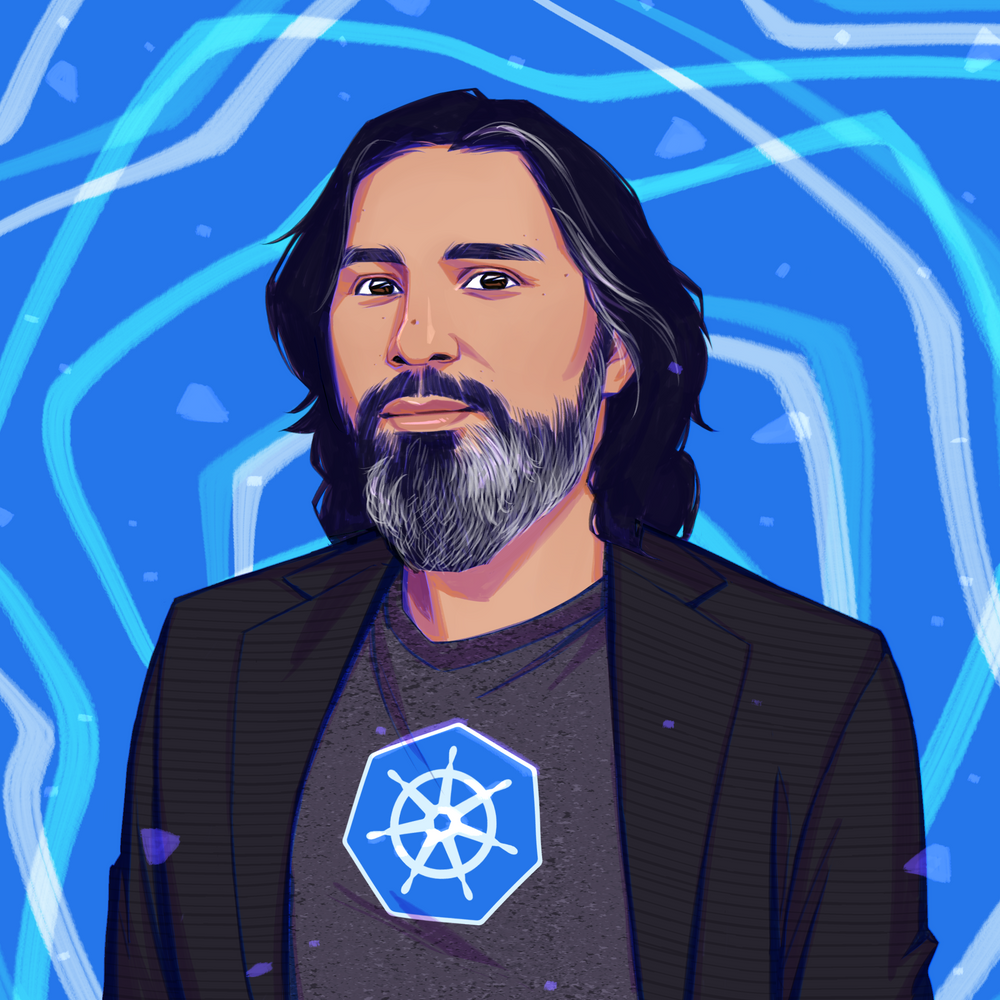
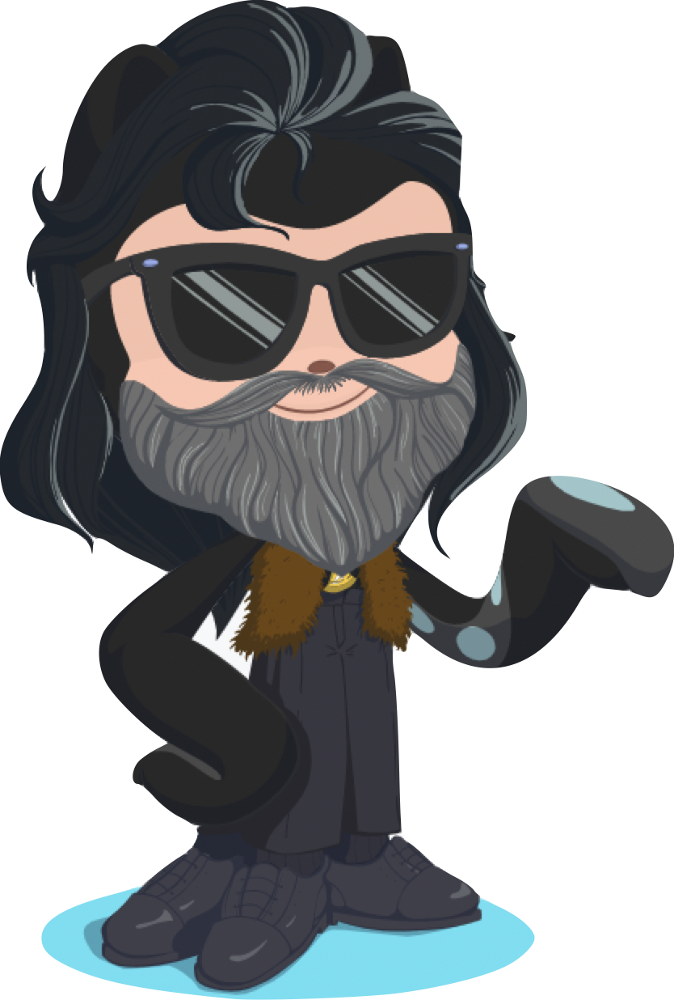

### Hi there 👋

 

 <a href= "https://calendly.com/cloudpirates/30min">Book a meeting with me</a>

I'm Alessandro, a software engineer living in Amsterdam, working at Microsoft and in my spare time as trainer for all things Cloud Native & Kubernetes. I organize the [Dutch Kubernetes Meetup](https://www.meetup.com/Dutch-Kubernetes-Meetup/) and [Kubernetes Community Days Amsterdam](https://kubernetescommunitydays.org/events/2021-amsterdam/).

Here's [my public GPG key](files/gpgkey.pub) (also on [OpenGPG.org](https://keys.openpgp.org/verify/hTwPB9RLSEjw2OEa6XDE0QRHPK3i3i1HbInXlJ5iBlc)). If you're into those old pesky _Curriculum Vitae_, check this [out](https://github.com/ams0/ams0/blob/main/files/CV2023.pdf).

### Things I believe in:

- People are foundamentally good, and they'll do good to others and themselves given the opportunity
- Infrastructure should be transparent, automated and at the service of the application (and eventually, to humans)
- Good work ethic and no-exception inclusion brings about a positive, productive environment where people thrive and business flourish
- Diversity is just the way the world is, fighting it with exclusion is an epitome of a toxic mentality
- Kubernetes is the best thing after fried chicken :)

### Some of my work:

- Some of my [terraform templates](https://github.com/ams0/terraform-templates)
- A [Github action](https://github.com/ams0/acr-task-github-action) to build containers with ACR
- A [Github Action](https://github.com/ams0/terraform-test-in-azure) to automatically test terraform templates in Azure
- Some links about the [Certified Kubernetes Security Specialist Exam](https://github.com/ams0/CKS)

You can find my blog on Medium under the [Cooking with Azure](https://medium.com/cooking-with-azure) publication. My (almost) current CV is in [here](https://github.com/ams0/ams0/blob/main/files/CV2023.pdf). I just started using Polywork my profile is at [poly.work/ams0](https://poly.work/ams0)

Some videos of me will soon appear under [/videos](https://github.com/ams0/ams0/tree/main/videos), and I hope to be able to post some cool techno set or track on my [Soundcloud](https://soundcloud.com/djmon0) soon.

### A little history of me:

I started working with computers at the early age of 8, with a Commodore64 around 1983, playing games and tinkering around with my [brother](https://www.linkedin.com/in/francescovozza/) on a [Commodore64](https://en.wikipedia.org/wiki/Commodore_64):

I discovered Linux in 1999, installing [Slackware 0.9](http://www.slackware.com/) on the old PC's at the Chemistry department of the University of Ferrara (and joined the [Ferrara Linux User Grup](https://ferrara.linux.it/)), and I never really stopped loving open source software.

I studied chemistry all my academic life, and I attended the Ph.D. program at the University of Amsterdam under Professor Fred Brouwer. I published a few scientific articles, here's a [list](https://www.researchgate.net/scientific-contributions/Alessandro-Vozza-42522315). My research was mainly about synthetic organic synthesis of metal-organic compounds and their study with ultrafast femtosecond laser spectroscopy.

After my experience at the UvA, I switched careers and moved thru a number of organizations until I scored my dream job at Red Hat (for an open source software lover, there was nothing better!). I eventually left and stared my own company, [Lovelace Engineering](http://lovelace.engineering/) (in memory of [Ada Lovelace](https://en.wikipedia.org/wiki/Ada_Lovelace)), and after a while joined Microsoft as Technical Evangelist and now as a Principal Software Engineer in the Commercial Software Engineering organization.

### How to reach me:

- Twitter: [@bongo](https://twitter.com/bongo)
- LinkedIn: [Alessandro Vozza](https://www.linkedin.com/in/alessandrovozza)
- Slack: alessandro @ [slack.k8s.io](https://slack.k8s.io)
- Discord: huxley#2417
- Good 'ol [email](mailto:alessandro.vozza@microsoft.com)

### 📈 &nbsp;Analytics

  

### :zap: Recent Activity

<!--START_SECTION:activity-->
1. 🗣 Commented on [#2](https://github.com/ams0/ams0/issues/2) in [ams0/ams0](https://github.com/ams0/ams0)
2. 🎉 Merged PR [#2](https://github.com/ams0/ams0/pull/2) in [ams0/ams0](https://github.com/ams0/ams0)
3. ❗️ Closed issue [#69](https://github.com/namecheap/terraform-provider-namecheap/issues/69) in [namecheap/terraform-provider-namecheap](https://github.com/namecheap/terraform-provider-namecheap)
4. 🗣 Commented on [#69](https://github.com/namecheap/terraform-provider-namecheap/issues/69) in [namecheap/terraform-provider-namecheap](https://github.com/namecheap/terraform-provider-namecheap)
5. 🗣 Commented on [#69](https://github.com/namecheap/terraform-provider-namecheap/issues/69) in [namecheap/terraform-provider-namecheap](https://github.com/namecheap/terraform-provider-namecheap)
6. ❗️ Opened issue [#69](https://github.com/namecheap/terraform-provider-namecheap/issues/69) in [namecheap/terraform-provider-namecheap](https://github.com/namecheap/terraform-provider-namecheap)
7. 🎉 Merged PR [#58](https://github.com/cloudnative-amsterdam/public-website/pull/58) in [cloudnative-amsterdam/public-website](https://github.com/cloudnative-amsterdam/public-website)
<!--END_SECTION:activity-->
