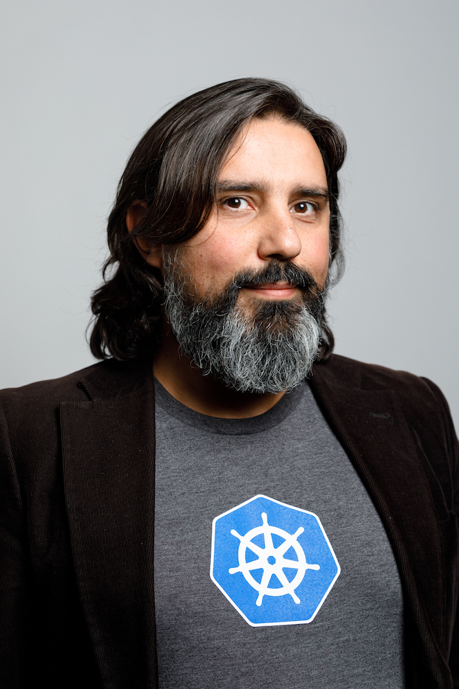

### Hi there 👋

I'm Alessandro, a software engineer living in Amsterdam, working at Microsoft and in my spare time as trainer for all things Cloud Native & Kubernetes. I organize the [Dutch Kubernetes Meetup](https://www.meetup.com/Dutch-Kubernetes-Meetup/) and [Kubernetes Community Days Amsterdam](https://kubernetescommunitydays.org/events/2021-amsterdam/).

### Things I believe in:

- People are foundamentally good, and they'll do good to others and themselves given the opportunity
- Infrastructure should be transparent, automated and at the service of the application (and eventually, to humans)
- Good work ethic and no-exception inclusion brings about a positive, productive environment where people thrive and business flourish
- Diversity is just the way the world is, fighting it with exclusion is an epitome of a toxic mentality
- Kubernetes is the best thing after fried chicken :)

### Some of my work:

- Some of my [terraform templates](https://github.com/ams0/terraform-templates)
- A [Github action](https://github.com/ams0/acr-task-github-action) to build containers with ACR
- A [Github Action](https://github.com/ams0/terraform-test-in-azure) to automatically test terraform templates in Azure
- Some links about the [Certified Kubernetes Security Specialist Exam](https://github.com/ams0/CKS)

You can find my blog on Medium under the [Cooking with Azure](https://medium.com/cooking-with-azure) publication. My (almost) current CV is in [here](files/CV_2020.pdf).

Some videos of me will soon appear under [/videos](https://github.com/ams0/ams0/tree/main/videos), and I hope soon to be able to post some cool techno set or track on my [Soundcloud](https://soundcloud.com/djmon0).

### A little history:

I started working with computers at the early age of 8, with a Commodore64 around 1983, playing games and tinkering around with my [brother](https://www.linkedin.com/in/francescovozza/). I discovered Linux in 1999, installing [Slackware 0.9](http://www.slackware.com/) on the old PC's at the Chemistry department of the University of Ferrara, and I never really stopped loving open source software.

I studied chemistry all my academic life, and I attended the Ph.D. program at the University of Amsterdam under Professor Fred Brouwer. I published a few scientific articles, here's a [list](https://www.researchgate.net/scientific-contributions/Alessandro-Vozza-42522315).

### How to reach me:

- Twitter: [@bongo](https://twitter.com/bongo)
- LinkedIn: [Alessandro Vozza](https://www.linkedin.com/in/tim-van-de-keer-bb5a1966/)
- Slack: alessandro @ [slack.k8s.io](https://slack.k8s.io)
- Discord: huxley#2417
- Good 'ol [email](alessandro.vozza@microsoft.com)
